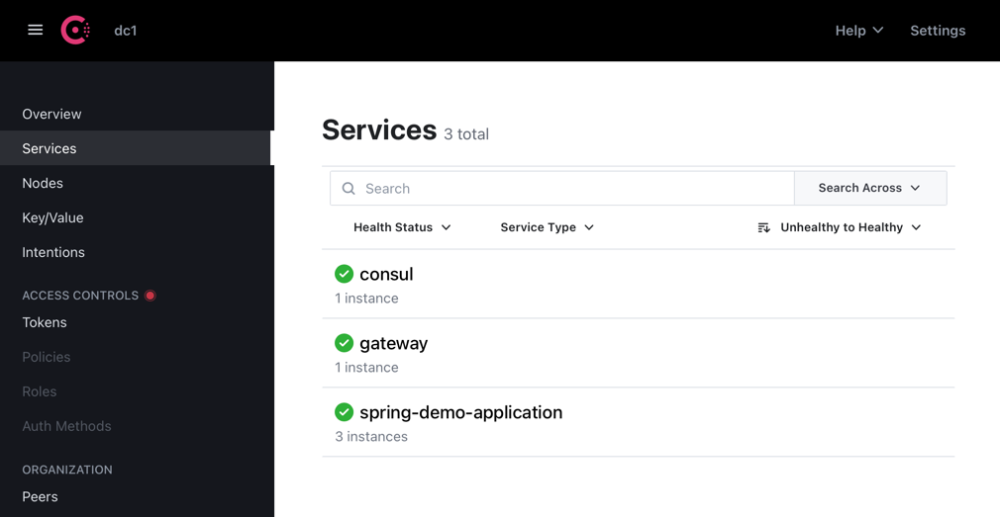

# Architecture showcase

[](https://opensource.org/licenses/MIT)

This project will be used to look more deeply into docker and microservices. For web service calls the example project "
spring-demo-application" is used. Consul serves as discovery service and key-value-store. The gateway is used as an
entry point for the web service calls and forwards them to the corresponding app. Furthermore, the load balancer can
also be used via the gateway configuration.

In the diagram below you can see the target architecture.


## Prerequisite

The example has been created for learning purposes only.

## How to run

First, the repository must be cloned:

```shell
git clone https://github.com/kirillesau/architecture-showcase.git
cd architecture-showcase
```

Then the following docker compose command must be executed:

```shell
docker compose up -d
```

### Consul

After the containers are up, the UI can be accessed at the following link: http://localhost:8501


#### Init demo key-value store

Example Data can be imported into the Key-Value-Store with the following command:

```shell
docker exec consul-server consul/config/kv-store/init-kv.sh
```

